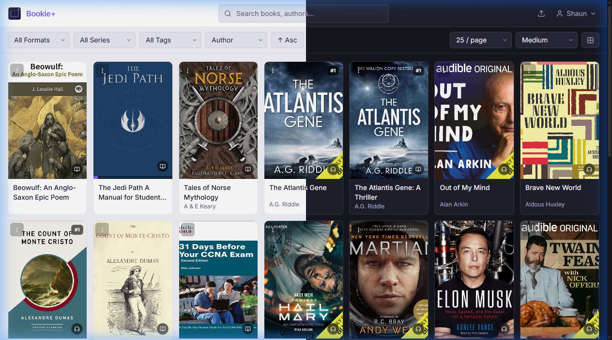
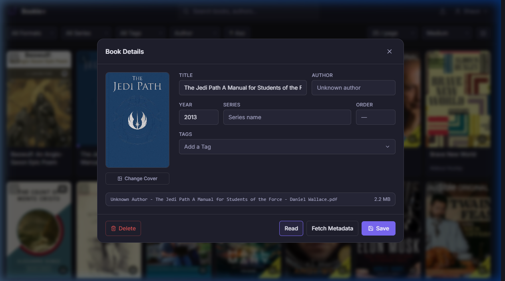
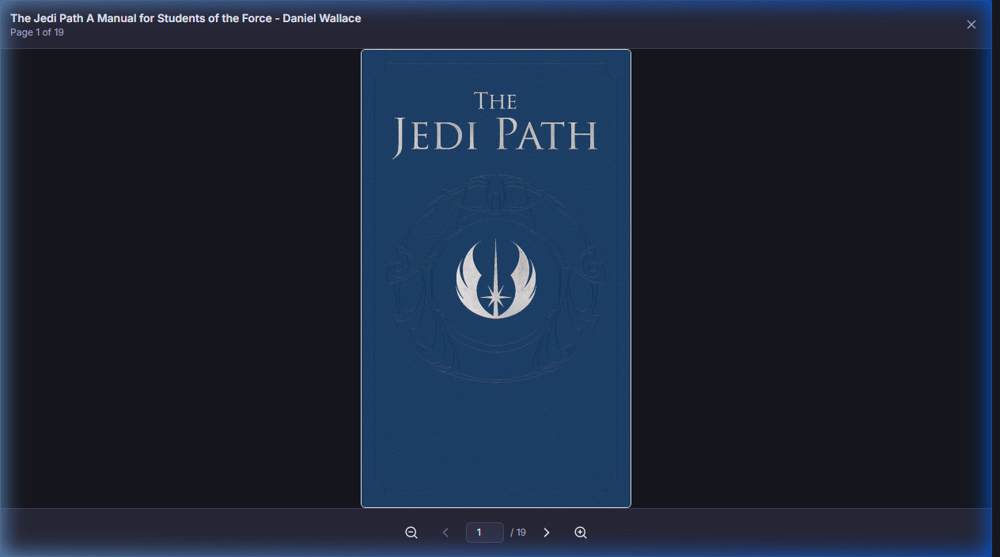
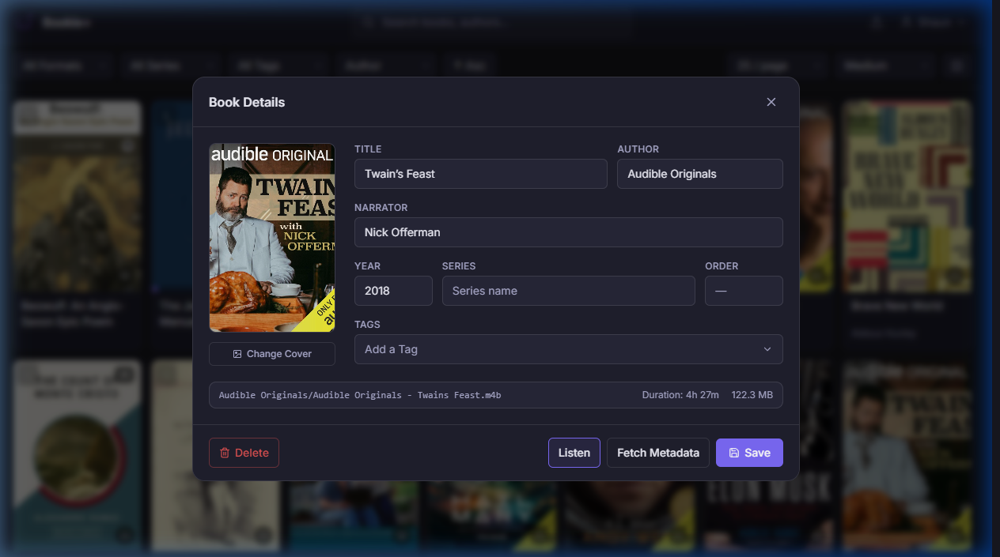
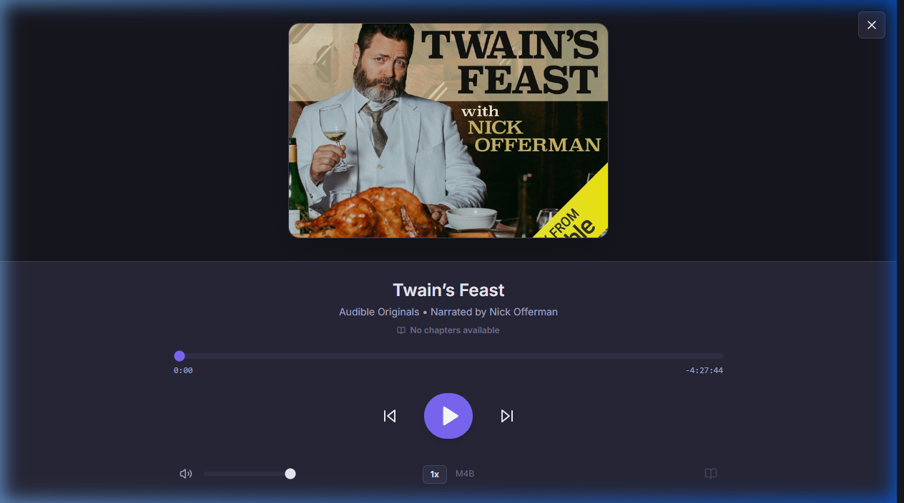

# Bookie+

A self-hosted ebook manager built for simplicity. Organize your library, fetch metadata, and send books directly to your eReader.

I have added the ability to host audiobooks, and the ability to listen to audiobooks and read the ebooks from the interface.

[](https://discord.gg/CrsSPrBwsC)

> This project is built with Claude and Gemini. 



---

## Features

**Library Management**
- Multi-format support:
  - Ebooks/Documents: EPUB, PDF, MOBI, AZW, AZW3, FB2, DJVU, CBZ, CBR, and TXT
  - Audiobooks: MP3, M4B, M4A, AAC, FLAC, OGG, WMA, and OPUS
- Automatic metadata fetching from Open Library, Apple Books, and Goodreads (with resilient individual entry parsing)
- Cover extraction, search, and direct embedding into EPUB files
- Series tracking and tagging (think shelves, minus the complexity)
- **Sort by Book Type**: Easily sort library views by format/type (Ebooks vs. Audiobooks)
- **Clean Author Names**: Bulk-format author metadata written as `Lastname, Firstname` to `Firstname Lastname` with automatic file re-organization on disk

**Organization & Reading**
- Configurable file rename schemes and folder structures, plus a button to open the book.
- **Embedded Ebook Reader**: Support reading EPUB and PDF files directly from the browser (fully offline-ready with local PDF.js worker)
- **Audiobook Player**: Integrated playback controls with track seeking, chapter markers (always visible/greyed out if unavailable), and adjustable playback speeds (0.5x to 2.5x)



- Book Reader screen



- Audiobook details screen with a listen button.



- Audiobook Player Screen




>[!NOTE]
>When migrating from a different solution, it is recommended you import your books into Bookie+ to ensure proper metadata management.

## Docker Compose

```yaml
services:
  bookie-plus:
    container_name: bookie-plus
    image: ghcr.io/OmegaRa/bookie-plus:latest
    ports:
      - "5000:5000"
    volumes:
      # Main configuration, database, keys, and covers
      - /path/to/config:/app/data
      # Maps your host's ebook folder
      - /path/to/your/ebooks:/app/data/books
      # Maps your host's audiobook folder
      - /path/to/your/audiobooks:/app/data/audiobooks
    environment:
      - SESSION_COOKIE_SECURE=false
    restart: unless-stopped
```

Access the UI at http://localhost:5000

## Companion Apps
- Bookie Reader https://github.com/OmegaRa/Bookie-Reader

## License

MIT
